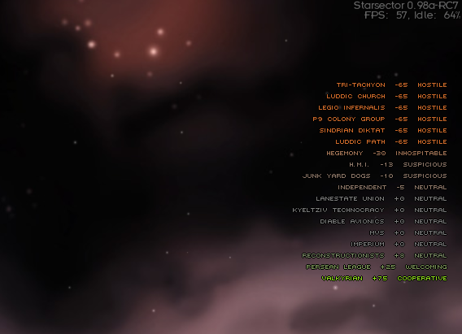

# Faction Relationships

A [Starsector](https://fractalsoftworks.com/) mod that shows a list of factions and their relationship with the player on the main navigation screen.



- **Game version**: 0.98a-RC8  
- **Mod ID**: `factionrelationships`

## Installation

1. Download the latest release (or build from source; see below).
2. Extract the mod folder into your Starsector `mods` directory.
3. Enable the mod in the game launcher.

Your `mods` folder should contain something like:

```
mods/FactionRelationships/
├── mod_info.json
├── config/
│   └── faction_relationships_config.json
└── jars/
    └── FactionRelationships.jar
```

## Configuration

Edit `config/faction_relationships_config.json` to set how many factions are shown. The `maxFactions` value can be set between 1 and 50 (default is 15).

## Building from source

- **Requirements**: JDK 17, a Starsector 0.98a install (for API JARs).
- **Build**: From the repo root, run `FactionRelationships\compile.bat`.  
  You may need to set `GAME_DIR` inside the script to your Starsector path.
- **Details**: See [FactionRelationships/COMPILATION.md](FactionRelationships/COMPILATION.md) for full build steps, project layout, and manual compile commands.

## License

This project is licensed under the MIT License — see the [LICENSE](LICENSE) file.
